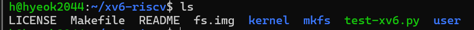

# 과제 1 - syscall hello

XV6환경은 새로 git에서  clone

syscall 구현을 위해서 다음과 같은 행위를 해준다:

### Kernel

1. `syscall.h`에 다음 구문을 추가하고
    
    
    
2. `syscall.c` 에 이렇게 두 줄 추가한 후

1. `sysproc.c` 에 system call당할 함수를 생성해 준다.
    
    
    

### User

1. `usys.pl` 는 원래는 어셈블리어로 코드를 작성해서  유저가 system call을 하는 부분을 자동화 해주는 도구이다.
    
    
    
2. `user.h` 에 함수를 지정해주고
    
    
    
3. `hello.c` 테스트 함수 생성

1. `Makefile` 수정

### Execution

자동으로 usys.S에  이렇게 추가된 것을 볼 수 있다.

