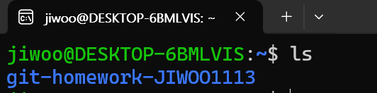

# 과제 2 - minishell

- 명세
    
    ---
    
    shell은 사용자가 운영체제와 상호작용할 수 있도록 하는 인터페이스 중 하나입니다. 사용자는 쉘에 명령어를 입력하게 되며, 쉘은 사용자가 입력한 명령어를 해석해 커널로 전달합니다. 이후 커널이 반환한 결과를 다시 사용자에게 보여줍니다.
    
    
    
    위와 같이 쉘에 ls 명령어를 입력하게 되면 쉘은 입력한 명령어를 운영체제로 전달하게 되고 그 결과를 아래에 보여줌을 알 수 있습니다.
    
    **쉘 바이너리** 하나가 필요하며 해당 바이너리를 실행시키면 아래와 같은 화면이 나타납니다. 
    
    
    
    해당 쉘에 ls, ps, cd 등의 명령어를 입력하면 일반적인 리눅스 cli와 비슷하게 작동해야 합니다. 이 과제에서는 Linux bash 쉘의 기능 중 일부분만 구현해보도록 하겠습니다.
    
    
    
    **쉘**은 명령어를 아래와 같은 방식으로 실행시킵니다.
    
    1. 사용자가 입력한 명령어 문자열을 받아서 파싱합니다.
    2. 파싱한 문자열을 토큰화(takenizing) 합니다.
    3. 만약 명령이 **쉘 자체에 내장된 빌트인 명령**이라면 쉘 내부에서 자체적으로 처리됩니다. 
    이 과제에서 구현할 빌트인 명령은 **cd, exit**입니다. (cd : change dir, exit : mini_shell 종료)
    4. 빌트인 명령이 아니라면 fork + execve 를 통해 프로그램을 실행합니다.
    fork는 자식 프로세스를 만드는 시스템 콜 API이고, execve는 현재 **프로세스의 메모리 공간을 새로운 프로그램으로 교체**하는 시스템 콜입니다. 자식 프로세스가 실행되는 동안 부모 프로세스인 쉘은 waitpid를 통해 대기합니다.
    
    execvp는 PATH 환경변수 검색 기능이 포함된 execve입니다. 만약 단순히 execve만 사용하면 /bin 이나 /usr/bin 등에서 원하는 프로그램을 찾아 실행시켜야 합니다. 
    
    
    
    그러나 execvp는 환경변수에서 해당 명령어를 자동으로 찾아주고, 실행 파일이 발견되면 해당 프로그램으로 프로세스를 덮어씌웁니다.
    
    쉘을 조금 더 꼼꼼하게 구현하려면 fg, bg등의 포그라운드/백그라운드, job 관리 추가, 파이프나 리다이렉션 연산 추가, race condition 방지, CTRL+C/Z 등으로 인한 시그널 전송 등을 전부 구현해서 관리할 수 있으니 관심 있다면 이 내용까지 구현해보는 것도 괜찮습니다.
    

cd, exit, fork

tokenize를 해서 자르면 된다.

### Tokenize

```c
>#include <stdio.h>
#include <string.h>

int main(void){
    char buf[1024];
    char* argv[10];
    int argc;

    while(1){
        printf("> ");
        if(fgets(buf, sizeof(buf), stdin) == NULL) break;

        // tokenize
        buf[strcspn(buf, "\n")] = '\0';

        argc = 0;
        char *token = strtok(buf, " ");
        while(token != NULL && argc < 10){
            argv[argc++] = token;
            token = strtok(NULL, " ");
        }
        // This is required for the last one.
        argv[argc] = NULL;

        // exit
        if(strcmp(argv[0], "exit") == 0){
            printf("exiting...\n");
            return 0;
        }
    }
}

```

### CD

우선은 실행이 되면 home directory부터 시작하는 것이 맞다.

`stdlib.h` 의`getenv("HOME")` 를 이용해준다.

```c
char *home_dir = getenv("HOME");
char *cur_dir = home_dir;

if (home_dir != NULL) {
    printf("Your HOME directory is: %s\n", home_dir);
} else {
    printf("The HOME environment variable is not set.\n");
    return 0;
}
```

iterative하게 이동을 해야 한다.

이미 linux에서 cd가 이미 구현이 되어있으니 그것을 이용하는 것이 좋다.

처음 생각했을 때는  current path를 넣어서 이것저것 해야할 줄 알았는데 리눅스에서 프로세스 차원으로 관리를 해주는 것을 알 수 있었다.

```c
static int cd(int argc, char **argv){
    const char *target = NULL;

    if(argc < 2 || strcmp(argv[1], "~") == 0){
        // home directory
        target = getenv("HOME"); 
    }
    else{
        // .. and . and all the stuff are consumed here.
        target = argv[1];
    }

    if(chdir(target) != 0){ 
        return 1; // actual CD + error processing
    }

    return 0;
}
```

1. 파싱 결과 불러오기
2. 인자가 따로 없으면 home으로
3. `../.` 등을 chdir (CD)에서 지원해 주는 기능 사용
4. target에 저장된 것을 cd를 이용해서 빼주기.

### execvp

우선 fork를 사용하지 않는 exec를 사용해보면

```c
#include <unistd.h>

execvp("ls", arglist);
```

이와 같이 코드를 작성하면 바로 실행 된다.

```c
#include <sys/wait.h>

waitpid(pid, &status, 0);
```

PID를 이용해서 구현하는 방법은 다음과 같다.

```c
else{ // execvp implementation
    pid_t pid;

    pid = fork();  
    if (pid == 0) { // child
        execvp(argv[0], argv);
    }
    else { // parent
        int status;
        waitpid(pid, &status, 0);  
    }
    
}
```

수업에 있는 내용대로 그대로 구현해 주면 된다.

위의 cd에서 path를 다 가져와서 구현은 간단하다.

### result

